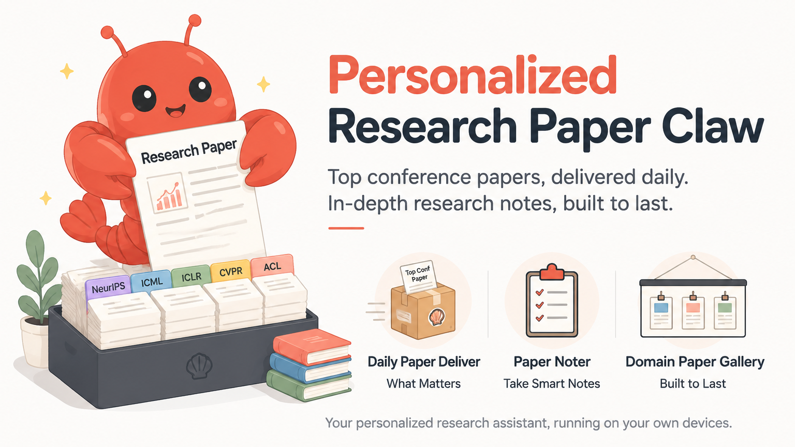

<div align="center">

[English](README.md) · **简体中文**

# 🧭 Personalized Research Paper Claw


一个由 **Research Agent** 主动推进论文发现、筛选、阅读与组织，以 **Human-in-the-loop** 融入您的**个性化偏好与关键判断**，并在本地沉淀长期知识资产的论文研究和学习系统。




持续为您推送贴合个人研究脉络的顶会论文，并按您自己的知识结构沉淀长期笔记。

[🧩 核心功能](#features) · [🚀 使用方式](#usage) · [🖼️ Domain Research Gallery 展示（由 Claw 产生）](https://jianlang.org/html/mllm-personalized-understanding.html) · [🖥️ 项目交互式主页](https://jianlang.org/html/research-paper-claw/index.zh-CN.html)

</div>

---

## 💥 News

- **2026-07-30** — Personalized Research Paper Claw 正式发布。[访问项目仓库](https://github.com/Jian-Lang/personalized-research-paper-claw)。

## 📋 TODO List

- [ ] 针对不同大类的论文制定更细化的笔记模板，例如 Survey、普通方法类（当前模板）和 Benchmark 类。

## 💡 为什么需要 Personalized Research Paper Claw

> **真正稀缺的不是论文，而是持续判断什么值得读，并记住它为什么重要。**
>
> 早上八点，咖啡刚放到桌上。昨晚更新的 ICML、ICLR、CVPR 和 ACL 接收目录里，又多了成百上千篇论文。您没有从头翻列表，也没有跳进鱼目混珠的 arXiv 信息流；打开 Obsidian，一张已经准备好的推荐页正在等您。
>
> Claw 记得您关注的 topics、具体方法关键词和明确排除的方向，也记得每个会议上次扫描到了哪里。它从持续更新的顶会接收目录继续向后寻找，只留下真正贴近您研究脉络的工作，并告诉您：哪些值得优先读，哪些可能带来启发，哪些看似相关却可以暂时跳过。
>
> 您扫过今日锐评和分流表，选中其中两篇。Claw 没有擅自把所有论文都“精读”一遍，也没有制造一堆无人维护的自动笔记。只有当您明确说出“读一下这篇论文”，它才接住这个决定，整理方法、实验、图表和关键概念，生成一份可以继续修改、引用和回看的详细笔记。
>
> 接下来，仍然由您决定这篇工作属于哪个 domain、应该放进哪一级 category，以及它是否真的值得进入自己的知识体系。Claw 负责把新工作和已有论文放在一起比较：它继承了什么，和谁形成对照，又能与哪些方法互补。机器处理重复劳动，研究者保留最终判断。
>
> 几个月后，您开始写 related work。曾经散落在浏览器、聊天记录和下载目录里的论文，此时已经沿着年份、类别和研究关系组织成一张 Domain Research Gallery。您不必再依靠模糊记忆寻找“之前好像读过的那篇论文”，因为当时为什么关注它、它解决了什么问题、它与其他工作的关系，都还保留在自己的 Markdown 知识库里。
>
> 当需要和导师、同学或合作者分享时，还可以把整个 domain 的知识总结一键导出成独立的 HTML 阅读页。分享出去的不只是一份论文列表，而是您对这个领域逐步形成的理解：重要工作有哪些、研究脉络如何发展、不同路线之间是什么关系，以及哪些问题仍然值得继续探索。

Personalized Research Paper Claw 负责把这条研究链路连接起来：

- 📬 **Daily Conf Paper Delivery**：记住您的细粒度偏好，从持续更新的顶会接收目录中寻找真正值得读的论文，让重要工作及时出现。
- 📝 **Research Paper Noter**：接住您亲自选择深入阅读的工作，把单篇理解沉淀为详细笔记，再逐步组织成属于您的 Personalized 汇总与 Domain Research Gallery。

一个负责让值得读的论文及时出现，一个负责让已经形成的理解不再消失。

这里的 Personalized 不是让 AI 自动揣测您的兴趣，更不是让它替您完成研究判断。推荐条件、阅读选择和领域结构都由您决定；Claw 负责记住这些选择，并把它们沉淀为由您长期掌握、可以持续生长，也可以随时分享的研究记忆。

**能力边界：** Personalized Research Paper Claw 不负责自动写论文或自动跑实验。它专注于个性化论文发现、深度阅读和长期知识组织。

<a id="features"></a>

## 🧩 两大核心功能

| 核心功能 | 您提供什么 | Claw 做什么 | 最终得到什么 |
| --- | --- | --- | --- |
| **📬 Daily Conf Paper Delivery** | 会议、topics、keywords、排除词与阈值 | 读取会议接收列表，按 title + abstract 计分筛选并去重，为每篇生成摘要式笔记，再按阅读优先级和 topic 汇总 | 一张包含今日锐评、阅读分流和全部论文摘要式笔记的每日推荐页 `DailyPaperContent-YYYY-MM-DD.md` |
| **📝 Research Paper Noter** | 标题、arXiv、DOI、本地 PDF、Zotero 条目或标题列表 | 生成或复用详细笔记，维护 Personalized 汇总，或构建带工作关系的 Domain Research Gallery | 结构化论文笔记、Personalized 汇总与可浏览的领域论文 Gallery（包括便于分享的 HTML 格式） |

---


## 📬 Daily Conf Paper Delivery

Daily Conf Paper Delivery 负责“把值得读的工作送到您面前”。它从上到下扫描仓库随附的人工智能顶会论文列表（例如 NeurIPS、ICML、ICLR、CVPR），无需在运行时联网抓取会议数据；系统按您的偏好对 title + abstract 计分，每个会议维护独立 cursor（上次扫描到列表第几篇的进度记录），每一天都从上一次记录的位置继续筛选并生成每日推荐页。

当前仓库提供 **ICML 2026、ICLR 2026、CVPR 2026 和 ACL 2026**。本项目会持续为每一个新的重要会议提供经过整理的接收论文列表更新。

您也可以按照[下方的自定义指南](#custom-conference-journal-lists)，接入其他领域的会议或期刊列表。

默认流程包含两步：

1. **筛选**：按 topics、keywords、排除词和阈值计分，选出达到阈值的论文。
2. **汇总与点评**：只根据摘要和已有结构化字段判断阅读优先级、按 topic 分类，为每篇生成摘要式笔记，并将当天的全部推荐集中写入同一张每日推荐页。

推荐页首先给出今日锐评和“必读 / 值得看 / 可跳过”分流表；每篇摘要式笔记包含作者、机构、来源与论文链接、可用时的首图、一句话总结、英文原始摘要与中文翻译、问题背景、动机、核心方法、评估、借鉴意义和锐评。

<a id="scoring"></a>

### 🎯 推荐逻辑

Daily Conf Paper Delivery 只有两个正向偏好入口：

- `topics`：较宽的研究方向，同时用于推荐页分类。
- `keywords`：具体方法名、任务名和需要精确关注的表达。

#### 🧮 分数如何计算

| 命中位置 | 分数 | 说明 |
| --- | ---: | --- |
| 一个 topic 在 title 或 abstract 中完整命中 | `+1` | 同一个 topic 每篇论文只计算一次 |
| 一个 keyword 在 title 中完整命中 | `+3` | 标题命中后不再重复计算该词的摘要分 |
| 一个 keyword 只在 abstract 中完整命中 | `+1` | 标题未命中时才计算 |
| 一个 exclude keyword 在 title 或 abstract 中命中 | `-100` | 论文进入排除状态 |

默认 `min_score = 2`。因此只命中一个 topic 的论文不会进入推荐；它还需要命中 keyword，或得到其他 topic 的支持。

匹配前会统一大小写和标点，并按完整单词或短语边界判断。配置中大小写、连字符等价的重复项只计算一次。每篇候选都会输出 `score_breakdown`，便于检查它为什么被选中。

每个会议每天最多推荐 `daily_take` 篇，并从当前 cursor 向后最多扫描 `scan_limit` 篇（默认 1000）；选满、达到扫描上限或走到列表末尾都会停止，因此实际推荐数可能更少。`shuffle` 只控制会议列表的稳定混排，不改变单篇论文的相关性分数。

<a id="custom-conference-journal-lists"></a>

<details>
<summary><strong>➕ 自行加入其他领域的会议或期刊列表</strong></summary>

您也可以直接对 Codex 说：`为 Daily Conf Paper Delivery 加入 <会议或期刊> <年份>，按照仓库现有 JSONL 格式整理论文列表并完成配置。`

如果希望手动接入，请准备与仓库相同格式的 JSONL，并放到：

```text
daily-conf-paper-delivery/data/paperlist/<CONF>/<conf>_<year>.jsonl
```

例如：

```text
daily-conf-paper-delivery/data/paperlist/NEURIPS/neurips_2026.jsonl
```

每行是一篇论文，`title` 和 `abstract` 为必填字段；`author`、`site`、`pdf`、`status` 为可选字段。然后在 `daily_papers.conferences` 中加入：

```json
{ "name": "NEURIPS", "year": 2026, "daily_take": 5 }
```

已有相同目录结构的本地 paperlist 时，可以导入当前配置中的会议文件：

```bash
cd daily-conf-paper-delivery
python3 scripts/sync_paperlist.py --source-dir /path/to/local/paperlist
```

该脚本只读取您指定的本地目录，不依赖外部论文列表仓库。

</details>

## 📝 Research Paper Noter

Research Paper Noter 负责“把确定要读的论文长期留下来”。输入可以是论文标题、arXiv、DOI、本地 PDF、Zotero 条目或标题列表。

> **🖼️ Highlight — Domain Research Gallery**：它不只是把 Markdown 放进文件夹，而是把一个 domain 下的论文按 category 与年份组织成可持续扩展的领域研究画廊。每项新加入的工作都带有首图、核心信息、详细笔记入口，以及它与本批或同领域已有工作的承接、对比和互补关系。除了作为长期知识源的 Markdown Gallery，还可以一键导出为精心排版、响应式的静态 **HTML 阅读页**：年份导航、论文卡片、首图、摘要、核心方法、评估与工作关系完整保留，无需 Obsidian 即可直接打开、托管和分享。

它提供两种长期组织模式：

| 模式 | 适合什么场景 | 输出 |
| --- | --- | --- |
| **Personalized** | 维护“我主动选择并读过的论文” | 详细笔记 + `PersonalizedPaperContent.md` |
| **Domain Research Gallery** | 围绕某个研究领域和子类别维护可浏览的 related work | 详细的单论文笔记 + 领域概览页 (Domain Research Gallery) + 按需导出的 Gallery HTML 阅读页 |

Personalized 模式按主题持续追加并去重；Domain Research Gallery 模式把详细笔记与分类 Gallery 分开维护。每个 category 页按年份和发布日期排序，展示论文首图、一句话总结、双语摘要、方法、评估、借鉴意义与“与其他工作的关系”；domain 索引则连接所有 category，同时保留 content 页中的手写内容。

这里的 `domain / category` 由您自主指定，用于组织自己的论文知识库；它与 Daily Conf Paper Delivery 中负责筛选和分类推荐的 `topics` 不是同一套参数，也不参与推荐打分。

<a id="installation"></a>

## 📦 安装

### 🧰 环境要求

- [Codex CLI](https://github.com/openai/codex)
- Python 3.8+
- [Obsidian](https://obsidian.md/)，最适合阅读与浏览这些笔记；长期维护的知识源是 Markdown，分享时可按需导出 HTML
- [Zotero](https://www.zotero.org/)，可选
- Poppler，可选但推荐，用于从 PDF 提取图片

macOS 可以通过 Homebrew 安装 Poppler：

```bash
brew install poppler
```

### 📥 克隆仓库

```bash
git clone https://github.com/Jian-Lang/personalized-research-paper-claw.git
cd personalized-research-paper-claw
```

克隆仓库不会启动任何论文流程，也不会注册后台任务。完成下面的配置并安装 Skills 后，仍需由您明确说“今日论文推荐”才会运行；自动推荐只有在您主动安装定时任务后才会开启。

### 🔗 安装 Skills

推荐使用符号链接安装。这样 Skill 会直接读取当前 checkout 中的配置、脚本和会议数据，仓库更新后也不需要重复复制 Skill 文件；自然语言定时管理也依靠这个链接定位调度工具，因此不建议复制 Skill 目录。

如果目标位置已经存在同名 Skill，请先自行备份或移走旧目录，再执行：

```bash
SKILLS_DIR="${CODEX_HOME:-$HOME/.codex}/skills"
mkdir -p "$SKILLS_DIR"

ln -s "$PWD/daily-conf-paper-delivery/skills/_shared" "$SKILLS_DIR/_shared"
ln -s "$PWD/daily-conf-paper-delivery/skills/daily-papers" "$SKILLS_DIR/daily-papers"
ln -s "$PWD/daily-conf-paper-delivery/skills/daily-papers-fetch" "$SKILLS_DIR/daily-papers-fetch"
ln -s "$PWD/daily-conf-paper-delivery/skills/daily-papers-review" "$SKILLS_DIR/daily-papers-review"
ln -s "$PWD/daily-conf-paper-delivery/skills/daily-papers-notes" "$SKILLS_DIR/daily-papers-notes"
ln -s "$PWD/research-paper-noter/skills/manual-papers" "$SKILLS_DIR/manual-papers"
ln -s "$PWD/research-paper-noter/skills/domain-papers" "$SKILLS_DIR/domain-papers"
ln -s "$PWD/research-paper-noter/skills/paper-reader" "$SKILLS_DIR/paper-reader"
ln -s "$PWD/research-paper-noter/skills/generate-mocs" "$SKILLS_DIR/generate-mocs"
```

<a id="usage"></a>

## 🚀 使用方式

### 📁 预备：配置全局 Markdown 根目录

所有推荐页、详细笔记和领域 Gallery 都会以普通 Markdown 文件留在您的本地；显式导出的 HTML 也会保存在对应 domain 内。您只需要配置一个全局可写目录；第一次运行对应 Skill 时，Daily、Personalized 和 Domain 会自然形成各自的子目录，无需提前准备任何 Markdown 文件。

先创建根级配置：

```bash
cp config/user-config.example.json config/user-config.local.json
```

编辑 `config/user-config.local.json`：

```json
{
  "paths": {
    "markdown_root": "~/ResearchNotes"
  }
}
```

这个根级配置只负责一件事：指定所有 Markdown 的存放位置。Daily 和 Noter 的偏好与自动化开关分别留在各自的配置中。

`markdown_root` 可以是已有的 Obsidian vault，也可以只是一个普通文件夹；如果目录尚不存在，首次运行会自动创建。Obsidian 不需要提前打开，也不需要提前建立 Daily、Personalized 或 Domain 文件夹。

目录会按需形成：

```text
{markdown_root}/
├── DailyPapers/                    # 第一次运行每日推荐时创建
├── PersonalizedPaper/             # 第一次手动整理论文时创建
└── DomainPapers/                   # 第一次整理 Domain 论文时创建
```

> 强烈推荐使用 Obsidian 阅读这些 Markdown。它不是运行依赖，也不要求购买或开启 Obsidian Sync；具体打开方式见本节末尾。

### ⚡ Quick Start：完成第一次 Daily 推荐

#### ⚙️ 1. 配置 Daily 推荐偏好

推荐直接对 Codex 说：

```text
请帮我初始化 Daily 推荐配置。
我的研究方向是 Recommendation Systems 和 LLM-based Recommendation；
重点关注 personalized recommendation assistant 和 conversational recommendation；
排除 medical 和 robotic。
```

`daily-papers` Skill 会根据模板创建本地配置，保留默认会议与运行设置，并写入您的研究方向、关键词和排除项。它只完成配置，不会在这一步开始推荐。

也可以手动从模板创建：

```bash
cp daily-conf-paper-delivery/skills/_shared/user-config.example.json \
  daily-conf-paper-delivery/skills/_shared/user-config.local.json
```

无论使用哪种方式，第一次运行前至少确认以下配置；代码样式标出的配置项都可以直接修改：

| 配置项 | 用途 |
| --- | --- |
| `daily_papers.conferences` | 使用哪些会议与年份 |
| `daily_papers.conferences[].daily_take` | 写在对应会议项内；该会议每天最多推荐多少篇，默认 `5` |
| `daily_papers.scan_limit` | 每个会议每天从当前扫描位置向后最多检查多少篇，默认 `1000` |
| `daily_papers.topics` | 您的研究方向与推荐页分类 |
| `daily_papers.keywords` | 具体方法名、任务名和同义表达 |
| `daily_papers.exclude_keywords` | 明确不希望进入推荐的方向 |
| `daily_papers.min_score` | 推荐阈值，默认 `2` |

最小示例：

```json
{
  "daily_papers": {
    "conferences": [
      { "name": "ICML", "year": 2026, "daily_take": 5 },
      { "name": "ICLR", "year": 2026, "daily_take": 5 },
      { "name": "CVPR", "year": 2026, "daily_take": 5 },
      { "name": "ACL", "year": 2026, "daily_take": 5, "shuffle": true }
    ],
    "scan_limit": 1000,
    "topics": [
      "MLLM Personalization",
      "Test-Time Adaptation"
    ],
    "keywords": [
      "personalized mllm",
      "multimodal memory",
      "test-time adaptation"
    ],
    "exclude_keywords": [
      "medical",
      "robotic"
    ],
    "min_score": 2
  }
}
```

全局配置和 Daily 本地配置都已被 git 忽略。

#### ▶️ 2. 启动推荐

在新的 Codex 会话中直接说：

```text
今日论文推荐
```

默认流程自动完成筛选与摘要式点评，结果写入：

```text
{markdown_root}/DailyPapers/mocs/DailyPaperContent-YYYY-MM-DD.md
```

#### ☀️ 3. 开启每日自动推荐

确认第一次推荐正常生成后，直接对 Codex 说：

```text
每天早上 8 点推荐论文
```

定时时间保存在 Daily 专属配置的 `automation.daily_run_time`，使用 24 小时制 `HH:MM`：

```json
{
  "automation": {
    "daily_run_time": "08:00"
  }
}
```

需要换时间时，直接说：

```text
把每日推荐改到 09:30
```

`daily-papers` Skill 会修改 `automation.daily_run_time`、重新加载本地定时任务并核验状态。这个步骤是可选的；开启或修改时间时不会额外运行一次推荐，系统会从下一个设定时间开始每天自动执行。查看状态和关闭方式见下面的 Daily 使用说明。

### 📬 Daily Conf Paper Delivery 的使用

#### 💬 常用入口

| 您对 Codex 说 | 结果范围 |
| --- | --- |
| `今日论文推荐` | 每个会议最多推荐 `daily_take` 篇 |
| `过去3天论文推荐` | 每个会议最多推荐 `daily_take × 3` 篇 |
| `过去一周论文推荐` | 每个会议最多推荐 `daily_take × 7` 篇 |
| `每天早上 8 点推荐论文` | 开启或更新每日定时推荐 |
| `查看每日推荐定时状态` | 查看是否启用以及当前运行时间 |
| `关闭每日论文推荐` | 移除本地定时任务 |

同一天重复运行默认复用当天结果，不继续推进 cursor。会议之间分别维护 cursor 和 `daily_take`，因此推荐数量与配比由配置直接决定。

这里的“过去 N 天”表示补取 N 份每日推荐配额，从各会议尚未推荐的论文中继续选择；会议接收列表不按论文发布日期过滤。

#### 🧪 可选的单步入口

这些入口确实存在，但前置条件不同：

| 触发词 | 前置条件 | 实际作用 |
| --- | --- | --- |
| `跑一下论文抓取` | 配置与本地会议接收列表已就绪 | 计分、去重并生成 `/tmp/daily_papers_enriched.json` |
| `跑一下论文点评` | 已成功完成抓取 | 读取富化结果并生成当天推荐页 |
| `跑一下论文笔记` | 富化结果与当天推荐页都存在 | 为评分最高的 3 篇论文生成详细笔记，并回填链接 |
| `更新索引` | Obsidian 笔记目录可写 | 手动重新生成论文目录页 / MOC |

`跑一下论文笔记` 是可选的第三步，不属于“今日论文推荐”的默认流程，也不能在缺少前两步产物时单独运行。

#### ⏰ 开启每日自动推荐

不需要手动编辑时间，也不需要记住脚本。直接对 Codex 说：

```text
每天早上 8 点推荐论文
把每日推荐改到 09:30
查看每日推荐定时状态
关闭每日论文推荐
```

`daily-papers` Skill 会在 macOS 上更新 Daily 配置、安装或移除 launchd 任务，并在操作后核验状态。开启定时不会立即补跑一轮；到达下一个设定时间后，系统才会自动执行“今日论文推荐”。clone 仓库、安装 Skill 或只填写 `daily_run_time` 都不会自行开启后台任务。

需要排障或不经过 Codex 时，仍可使用底层命令：

```bash
cd daily-conf-paper-delivery
./bin/configure-schedule.sh --time 08:00
./bin/configure-schedule.sh --status
./bin/configure-schedule.sh --remove
```

定时任务会调用非交互推荐脚本，适合受信任的个人机器。

### 📝 Research Paper Noter 的使用

Research Paper Noter 直接复用根目录的 `config/user-config.local.json`，不再维护第二套笔记根目录配置。默认目录如下：

| 目录 | 用途 |
| --- | --- |
| `{markdown_root}/PersonalizedPaper` | 主动阅读与累计汇总 |
| `{markdown_root}/DomainPapers` | 按 domain/category 组织的 Research Gallery |

Zotero 是可选输入源；需要时再复制 `research-paper-noter/skills/_shared/user-config.example.json`，配置数据库、附件路径以及 Noter 自己的索引与 git 行为。

#### 📌 Personalized：维护主动阅读清单

对 Codex 说：

```text
手动论文阅读：Retrieval-Augmented Dynamic Prompt Tuning for Incomplete Multimodal Learning
```

批量输入时可以继续列出标题、arXiv 或 DOI。该入口会逐篇生成或复用详细笔记，并追加到：

```text
{markdown_root}/PersonalizedPaper/
├── mocs/PersonalizedPaperContent.md
└── papers/
```

也可以使用 shell：

```bash
cd research-paper-noter
./bin/paper-read.sh "Paper title or arXiv URL"
```

只想阅读单篇论文、不维护 Personalized 或 Domain 汇总时，可以直接说：

```text
读一下这篇论文 <arXiv URL、标题或本地 PDF>
```

#### 🖼️ Domain Research Gallery：把 related work 变成可浏览的领域画廊

对 Codex 明确提供 domain、category 和论文：

```text
domain 论文整理：
Domain: MLLM Personalization
Category: Personalized Understanding / Long-Context Personalization
Paper: TAMEing Long Contexts in Personalization: Towards Training-Free and State-Aware MLLM Personalized Assistant
```

添加论文时，`Domain` 和 `Category` 都是必填项。在 `MLLM Personalization` 这个 Domain 下，`Category` 可以只写一层，例如 `Personalized Understanding`；也可以用 `/` 或 `>` 写成多级路径，例如 `Personalized Understanding / Long-Context Personalization`。

或使用 shell：

```bash
cd research-paper-noter
./bin/domain-paper-add.sh \
  "MLLM Personalization" \
  "Personalized Understanding / Long-Context Personalization" \
  "TAMEing Long Contexts in Personalization: Towards Training-Free and State-Aware MLLM Personalized Assistant"
```

输出严格分成详细笔记与 Gallery：

```text
{markdown_root}/DomainPapers/{domain}/
├── paper/                         # 每篇论文的完整笔记
├── content/
│   ├── _index.md                  # Domain Gallery 入口
│   └── {category_path}.md         # 可浏览的 category Gallery
└── html/                          # 明确要求导出后才创建
    ├── index.html                 # 整个 domain 的分享页
    └── {category_slug}.html       # 指定子领域的分享页
```

每次加入论文，Noter 会更新对应 category Gallery：按年份与发布日期组织条目，展示首图、核心方法、评估和借鉴意义，并用“与其他工作的关系”说明这项工作继承了什么、与谁对比、又能和哪些工作互补。详细笔记通过 Obsidian 双链与 Gallery 条目相连，因此它既适合快速横向浏览，也能随时下钻到单篇论文。

> **`Note`**：多级 category 中，前面的层级形成目录，最深一级形成实际的 Gallery 文件。
>
> - 两级：`LLM-based Recommendation / Conversational Recommendation` → `content/LLM-based Recommendation/Conversational Recommendation.md`
> - 三级：`LLM-based Recommendation / Conversational Recommendation / User Profiles` → `content/LLM-based Recommendation/Conversational Recommendation/User Profiles.md`
>
> 父级不会自动生成额外的聚合 Gallery。

#### ♻️ 批量重建 category Galleries：让领域概览跟上笔记更新

当一个 domain 的论文集合、category 或基础元信息经过批量调整后，可以明确要求从当前 `paper/*.md` 重建该 domain 下的全部 category Galleries，也可以只重建其中一个子领域：

```text
重新生成 Recommendation Systems domain 下的全部 category Galleries
重新生成 Recommendation Systems domain 下 LLM-based Recommendation 子领域的 Gallery
```

也可以直接运行脚本；第一个命令批量重建所有内层 Gallery，第二个命令只重建指定子领域：

```bash
cd research-paper-noter
./bin/domain-paper-gallery-rebuild.sh "Recommendation Systems"
./bin/domain-paper-gallery-rebuild.sh \
  "Recommendation Systems" \
  "LLM-based Recommendation"
```

首次添加论文时仍必须提供 `domain + category`，因为系统需要知道论文应进入哪张内层 Gallery；批量重建只需要 domain，是因为现有笔记已经记录了各自的 category。重建以详细笔记确认论文集合、分类与基础元信息，同时保留 sidecar 中已经整理好的 Gallery 摘要和工作关系，再刷新 category Gallery 与 domain 索引；它不会新增一张外层聚合 Gallery，`content/_index.md` 仍只是连接各 category 的导航入口。重建也不会重新生成论文笔记、导出 HTML、commit 或 push，正常添加论文时不会自动触发批量重建。

#### 🌐 一键导出 HTML：把 Research Gallery 变成分享即用的阅读页面

当一套 Domain Research Gallery 已经整理成熟，可以把它一键转换成独立的静态 HTML 阅读页。页面沿用 Gallery 的信息密度与研究脉络，保留论文首图、年份与 Venue、摘要、核心方法、评估、借鉴意义和工作关系；同时提供清晰的论文导航与响应式排版，无需安装 Obsidian，浏览器打开即可阅读，也可以直接托管到个人主页或静态网站。

导出整个 domain 时，所有 category/subcategory 会汇集到同一页面，并在每篇论文上标明所属子领域：

```text
导出 Recommendation Systems domain 的 HTML
```

只分享某个子领域时，继续提供 category 路径；多级路径沿用 `/`：

```text
导出 Recommendation Systems domain 的 LLM-based Recommendation 子领域 HTML
```

也可以直接运行脚本：

```bash
cd research-paper-noter
./bin/domain-paper-gallery-html.sh "Recommendation Systems"
./bin/domain-paper-gallery-html.sh \
  "Recommendation Systems" \
  "LLM-based Recommendation"
```

HTML 默认写入 `{markdown_root}/DomainPapers/{domain}/html/`。这是一个完全按需的分享出口：正常添加 domain 论文时不会自动导出 HTML，也不会修改已有笔记、content Gallery 或索引。

### 🔮 强烈推荐：用 Obsidian 阅读生成的笔记

Obsidian 把本地文件夹当作 vault 使用，不需要导入或转换 Markdown：

1. 安装并打开 [Obsidian](https://obsidian.md/)。
2. 选择 **Open folder as vault / 打开文件夹作为仓库**。
3. 选择全局配置中的 `markdown_root`，例如 `~/ResearchNotes`。
4. Obsidian 会自动显示 `DailyPapers`、`PersonalizedPaper` 和 `DomainPapers`，并识别项目生成的 `[[双向链接]]`、图片和索引页。

Obsidian 会自行创建 `.obsidian` 配置目录；本项目不会创建或修改它。Obsidian Sync 完全可选，不开启也能在本机正常阅读。以后 Skill 新增的 Markdown 会直接出现在同一个 vault 中。

## 🗂️ 输出结构

```text
ResearchNotes/
├── DailyPapers/
│   ├── mocs/DailyPaperContent-YYYY-MM-DD.md
│   └── papers/
├── PersonalizedPaper/
│   ├── mocs/PersonalizedPaperContent.md
│   └── papers/
└── DomainPapers/
    └── {domain}/
        ├── paper/
        ├── content/
        │   ├── _index.md
        │   └── {category_path}.md
        └── html/                    # 显式导出后才创建
            ├── index.html
            └── {category_slug}.html
```

三类产物不会互相混写：Daily 用于发现，Personalized 用于主动阅读，Domain Research Gallery 用于浏览、比较并长期维护 related work。

## 🏗️ 仓库结构

```text
Personalized-Research-Paper-Claw/
├── README.md
├── README.zh-CN.md
├── LICENSE
├── config/                            # 全局 Markdown 根目录配置
│
├── daily-conf-paper-delivery/        # Daily Conf Paper Delivery
│   ├── bin/                          # 手动入口与调度配置脚本
│   ├── data/paperlist/               # 会议接收论文列表
│   ├── scripts/                      # 本地会议列表导入
│   ├── skills/
│   │   ├── daily-papers/             # 一句话总入口
│   │   ├── daily-papers-fetch/       # 筛选、计分与去重
│   │   ├── daily-papers-review/      # 摘要式点评
│   │   ├── daily-papers-notes/       # 可选详细笔记步骤
│   │   └── _shared/                  # 配置与公共工具
│   ├── README.md
│   ├── README.zh-CN.md
│   └── ARCHITECTURE.md
│
└── research-paper-noter/             # Research Paper Noter
    ├── bin/
    │   ├── paper-read.sh             # Personalized 入口
    │   ├── domain-paper-add.sh       # Domain 论文添加入口
    │   ├── domain-paper-gallery-rebuild.sh # Domain Gallery 重建入口
    │   └── domain-paper-gallery-html.sh    # Domain Gallery HTML 导出入口
    ├── skills/
    │   ├── manual-papers/
    │   ├── domain-papers/
    │   ├── paper-reader/
    │   ├── generate-mocs/
    │   └── _shared/
    ├── README.md
    ├── README.zh-CN.md
    └── ARCHITECTURE.md
```

## ⚠️ 项目边界

- 每日推荐基于会议列表中的 title + abstract，不等于全文审稿。
- 详细笔记会读取更多论文内容，但 AI 生成的信息、公式解释和评价仍需人工核验。
- Zotero 是可选输入源；Daily 推荐不依赖 Zotero。
- Obsidian 是强烈推荐的浏览与双链环境；长期知识源仍是标准 Markdown，HTML 只在明确要求时作为分享格式生成。
- 默认不执行 git commit、push 或任何 Obsidian 同步；Codex 执行任务时会读取完成当前任务所需的相关笔记内容。

## 📚 文档

- [Daily Conf Paper Delivery 使用说明](daily-conf-paper-delivery/README.zh-CN.md)
- [Daily Conf Paper Delivery 架构](daily-conf-paper-delivery/ARCHITECTURE.md)
- [Research Paper Noter 使用说明](research-paper-noter/README.zh-CN.md)
- [Research Paper Noter 架构](research-paper-noter/ARCHITECTURE.md)
- [本地部署与定时任务](daily-conf-paper-delivery/LOCAL_DEPLOY.md)

## 💬 交流与联系

如有问题、Bug、功能建议或代码贡献，欢迎提交 [Issue](https://github.com/Jian-Lang/personalized-research-paper-claw/issues)、发起 [Pull Request](https://github.com/Jian-Lang/personalized-research-paper-claw/pulls)，或通过邮箱联系我们：[jian_lang@std.uestc.edu.cn](mailto:jian_lang@std.uestc.edu.cn)。

## 📄 License

Apache License 2.0. See [LICENSE](LICENSE).

## 🙏 致谢

特别感谢 [huangkiki/dailypaper-skills](https://github.com/huangkiki/dailypaper-skills) 的作者。她提供的原始论文笔记模板，为本项目早期的笔记结构提供了重要参考。

如果这个仓库对您的研究工作流有所帮助，欢迎给它一个 [Star](https://github.com/Jian-Lang/personalized-research-paper-claw) ⭐
